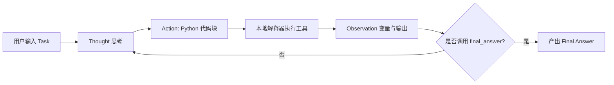

# 🤖 Agent-Learn: AI 智能体学习与实践

本项目用于系统记录学习 Hugging Face 官方 AI Agent 课程全流程的代码实现、对比实验与核心原理。

* **官方课程链接**：[Hugging Face - Agents Course (Unit 1: Dummy Agent Library)](https://huggingface.co/learn/agents-course/unit1/dummy-agent-library)
* **大模型驱动**：智谱 AI (GLM-4 / GLM-4-Flash)
* **开发者**：Zjwexercise

---

## 📅 2026-09-09 学习日志：Unit 1 - 手搓基础智能体 (Dummy Agent)
## 📋 学习日志速览 (Daily Log / TL;DR)

> **2026-09-09 学习纪要**
> - **核心概念**：掌握 ReAct 机制底层闭环（Stop 截断防幻觉），理解工业级框架 `smolagents` 对循环的内化封装及 `CodeAgent`（代码块作为 Action）的效率跃迁。
> - **代码实践**：手写实现白盒 Dummy Agent；克隆并复现 Hugging Face 官方 `First_agent_template` 智能体。
> - **排错攻坚**：定位并解决 Prompt 样例污染（输入展平 `flatten_messages_as_text=True`）、Gradio 6 `type` 参数失效、官方 Space `visit_webpage.py` 遗漏 `import re` 等问题。
> - **功能交付**：交付支持 Gradio Web 网页端与 CLI 命令行双模式的完整智能体，装配天气、高精度计算器、时区、搜索等 7 项工具。

---

## 📖 核心原理解析与详细教程 (Tutorials & Deep Dive)

### 模块一：手搓基础智能体 (Dummy Agent Library)

### 1. 核心原理：ReAct 循环机制 (Reason + Act)
AI Agent 与普通问答机器人的本质差异在于：模型不仅仅输出文本，还具备**自主思考、调用外部环境工具、观测反馈并得出结论**的闭环能力。

```text
用户提问 
  └─► 1. Thought (思考)       : 模型分析需求，决定调用工具
        └─► 2. Action (行动)        : 模型输出标准 JSON 指令
              └─► 🛑 触发 stop 截断 : 强制拦截模型生成，防止凭空捏造数据
                    └─► 3. Tool Exec (执行)   : 本地 Python 运行真实业务函数
                          └─► 4. Observation (观察) : 将真实数据回填上下文
                                └─► 5. Final Answer (结论) : 模型依据事实产出最终回答
```

---

### 2. 关键对比实验现象剖析

在 [`chapter1/DummyAgentLibrary.py`](chapter1/DummyAgentLibrary.py) 中，我们对比了 3 种不同阶段的输出差异：

| 实验阶段 | 关键代码设计 | 输出表现 | 本质原因 |
| :--- | :--- | :--- | :--- |
| **阶段 1：未加 Stop** | 无 `stop` 参数 | 模型自导自演编造了 `Observation` 和答案 | 模型是概率预测文本，未受外界物理阻断前会持续“幻想”后续对话 |
| **阶段 2：加了 Stop** | `stop=["Observation:"]` | 模型在输出 `Action` 后立即刹车并暂停 | 大模型推理引擎遇到停用词立即停止解码，将控制权让渡给宿主程序 |
| **阶段 3：真实闭环** | 运行本地函数并回填 `Observation` | 模型获得真实观测结果，输出精准的 `Final Answer` | **ReAct 范式闭环完成**，模型基于确定性外部事实推理出最终结论 |

---

### 3. 工程规范与安全实践
1. **环境变量管理**：敏感 API Key 移入根目录下的 `.env` 文件，并通过 `.gitignore` 彻底与代码仓库隔离。提供 `.env.example` 作为团队配置模板。
2. **虚拟环境隔离**：在项目根目录设立独立的 `.venv` 环境，避免全局安装依赖造成版本混乱（Dependency Hell）。
3. **网络与代理配置**：排查本地代理端口（如 7897）与国内镜像源握手失败（Error 10054）的场景，规范使用官方源与代理分流策略。

---

## 📅 2026-09-09 学习日志（进阶）：Unit 1 - 官方模板实战 (First Agent Template)
### 模块二：官方模板实战与架构演进 (First Agent Template)

* **官方空间参考**：[Hugging Face Space: First_agent_template](https://huggingface.co/spaces/agents-course/First_agent_template)

### 1. 核心架构演进：ReAct 循环的封装与 CodeAgent 的革新
很多初学者会疑惑：“手写的 `while (Thought -> Action -> Observation)` 循环去哪了？”
- **循环内化（Encapsulated Loop）**：循环并没有消失，而是被 `smolagents.MultiStepAgent` 内部的 `_run_stream` 接管（`while not returned_final_answer and step <= max_steps`）。工业级框架统一管理了状态机、异常重试与 Memory 记忆回填。
- **CodeAgent 的单步高效性**：从传统的“单步单工具 JSON 模式”升级为“Python 代码块模式”。模型可以在单个 Action 中直接写变量传递、同时调用多个工具（如同时查询天气与时间），大幅削减与 LLM 的往返轮次与 Token 消耗。



---

### 2. 关键排错与深度避坑指南

1. **问答不一致与 Few-shot 污染排查**：
   - **现象**：询问巴黎天气，智能体却盲目回答教皇年龄或纽约时间。
   - **根因**：`smolagents` 默认将输入打包为嵌套列表 `[{'type': 'text', ...}]`，部分兼容端点解析异常导致模型以为“无提问”，进而直接抄袭系统提示词中的内置 Few-shot 样例。
   - **方案**：配置 `OpenAIServerModel(..., flatten_messages_as_text=True)` 强制展平纯文本，输入识别率恢复 100%。
2. **Gradio 6 兼容性修复**：
   - 官方 Space 编写于 Gradio 5 时代，在 Gradio 6 下调用 `gr.Chatbot(type="messages", resizeable=True)` 会抛出 `TypeError: unexpected keyword argument 'type'`。
   - 通过动态反射签名参数进行自适应升级，保障跨版本无缝运行；本地默认设置 `share=False` 避免反向代理隧道（frpc）卡顿。
3. **修复官方原生 Bug**：
   - 官方 `tools/visit_webpage.py` 内部调用了 `re.sub` 却遗漏了 `import re`，已全部修复。
   - 适配 `ddgs` 与 `duckduckgo_search` 双版本导入机制。

---

### 3. 自定义拓展工具箱列表

在官方仅有一个未激活示例工具的基础上，我们大幅拓展了智能体的感知与行动边界：

| 工具名称 | 对应模块 | 功能特性 |
| :--- | :--- | :--- |
| `final_answer` | `tools/final_answer.py` | 官方终结输出工具，总结最终结论 |
| `get_current_time_in_timezone` | `app.py` | 全球主要城市（北京/巴黎/伦敦/东京等）时区映射与本地时间查询 |
| `get_weather` | `app.py` | 城市实时天气与体感状态查询 |
| `calculator` | `app.py` | 安全执行高精度数学与科学计算（三角函数/指数/开方） |
| `web_search` | `tools/web_search.py` | 激活 DuckDuckGo 公网实时多源信息搜索 |
| `visit_webpage` | `tools/visit_webpage.py` | 抓取公网 URL 内容并自动转换为 Markdown 文本供智能体阅读 |
| `my_custom_tool` | `app.py` | 文本多维度结构分析（字符数/词数/行数统计） |

---

## 📂 项目结构
```text
agent-learn/
├── .env.example               # 环境变量配置模板
├── .gitignore                 # Git 忽略配置规则 (严格保护 .env 和 .venv)
├── README.md                  # 学习日志与项目索引
├── chapter1/                  # 第一章：底层原理白盒学习
│   └── DummyAgentLibrary.py   # 手写 ReAct 机制完整对比实验
└── First_agent_template/      # 官方标准课程智能体 (Space 完整复刻与拓展)
    ├── .gitattributes         # 官方 Git LFS 配置
    ├── agent.json             # 智能体元数据描述
    ├── app.py                 # 主程序入口 (支持 Gradio Web UI 与 --cli 模式)
    ├── Gradio_UI.py           # 官方可视化 Web 前端交互组件
    ├── prompts.yaml           # 现代 Jinja 提示词模版
    ├── requirements.txt       # 项目依赖清单
    ├── README.md              # Space 独立说明文档
    └── tools/                 # 核心工具包
        ├── __init__.py
        ├── final_answer.py    # 终结工具
        ├── web_search.py      # 网页搜索工具
        └── visit_webpage.py   # 网页抓取与阅读工具
```

---

## 🚀 快速开始

1. **环境准备**：
   ```bash
   python -m venv .venv
   .\.venv\Scripts\Activate.ps1
   pip install -r First_agent_template/requirements.txt
   ```
2. **配置密钥**：
   在项目根目录 `.env` 中填入你的智谱 API Key：
   ```bash
   ZHIPUAI_API_KEY="your_api_key_here"
   ```
3. **运行测试**：
   - **第一章 手搓 ReAct 基础智能体**：
     ```bash
     python .\chapter1\DummyAgentLibrary.py
     ```
   - **进阶实战 1：命令行秒级自测**：
     ```bash
     python .\First_agent_template\app.py --cli
     ```
   - **进阶实战 2：启动浏览器图形化交互 Web UI**：
     ```bash
     python .\First_agent_template\app.py
     ```
