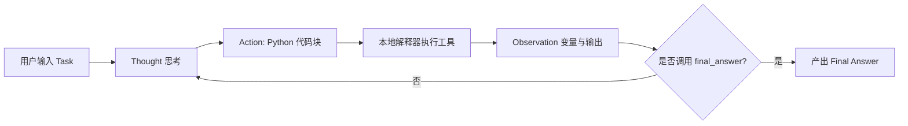

# 📖 Unit 1: 智能体基础与初识工具 (Dummy Agent & First Agent Template)

本目录为 Hugging Face 官方课程 **Unit 1** 的全部实践与原理解析，包含三个逐步递进的模块：
本目录为 Hugging Face 官方课程 **Unit 1** 的全部实践与原理解析，包含四个逐步递进的模块：
1. **`dummy_agent/`**：手搓白盒 ReAct 智能体（理解 Stop 截断、思维链与工具闭环）；
2. **`First_agent_template/`**：工业级框架 `smolagents` 官方模板克隆、修复与 7 大工具拓展实战；
3. **`test.py` (本地开源模型进阶)**：本地 Ollama 小模型落地、硬件内存压榨调优与 CodeAgent vs ToolCallingAgent 范式深度对比。
2. **`Decoding/`**：底层机制探秘（大模型如何逐词决策？Greedy 与 Beam Search 树状可视化拆解）；
3. **`First_agent_template/`**：工业级框架 `smolagents` 官方模板克隆、修复与 7 大工具拓展实战；
4. **`test.py` (本地开源模型进阶)**：本地 Ollama 小模型落地、硬件内存压榨调优与 CodeAgent vs ToolCallingAgent 范式深度对比。

---

## 模块一：手搓基础智能体 (Dummy Agent Library)

### 1. 核心原理：ReAct 循环机制 (Reason + Act)
AI Agent 与普通问答机器人的本质差异在于：模型不仅仅输出文本，还具备**自主思考、调用外部环境工具、观测反馈并得出结论**的闭环能力。

```text
用户提问 
  └─► 1. Thought (思考)       : 模型分析需求，决定调用工具
        └─► 2. Action (行动)        : 模型输出标准 JSON 指令
              └─► 🛑 触发 stop 截断 : 强制拦截模型生成，防止凭空捏造数据
                    └─► 3. Tool Exec (执行)   : 本地 Python 运行真实业务函数
                          └─► 4. Observation (观察) : 将真实数据回填上下文
                                └─► 5. Final Answer (结论) : 模型依据事实产出最终回答
```

---

### 2. 关键对比实验现象剖析

在 [`dummy_agent/DummyAgentLibrary.py`](dummy_agent/DummyAgentLibrary.py) 中，我们对比了 3 种不同阶段的输出差异：

| 实验阶段 | 关键代码设计 | 输出表现 | 本质原因 |
| :--- | :--- | :--- | :--- |
| **阶段 1：未加 Stop** | 无 `stop` 参数 | 模型自导自演编造了 `Observation` 和答案 | 模型是概率预测文本，未受外界物理阻断前会持续“幻想”后续对话 |
| **阶段 2：加了 Stop** | `stop=["Observation:"]` | 模型在输出 `Action` 后立即刹车并暂停 | 大模型推理引擎遇到停用词立即停止解码，将控制权让渡给宿主程序 |
| **阶段 3：真实闭环** | 运行本地函数并回填 `Observation` | 模型获得真实观测结果，输出精准的 `Final Answer` | **ReAct 范式闭环完成**，模型基于确定性外部事实推理出最终结论 |

---

### 3. 工程规范与安全实践
1. **环境变量管理**：敏感 API Key 移入根目录下的 `.env` 文件，并通过 `.gitignore` 彻底与代码仓库隔离。提供 `.env.example` 作为团队配置模板。
2. **虚拟环境隔离**：在项目根目录设立独立的 `.venv` 环境，避免全局安装依赖造成版本混乱（Dependency Hell）。
3. **网络与代理配置**：排查本地代理端口（如 7897）与国内镜像源握手失败（Error 10054）的场景，规范使用官方源与代理分流策略。

---

## 模块二：官方模板实战与架构演进 (First Agent Template)

* **官方空间参考**：[Hugging Face Space: First_agent_template](https://huggingface.co/spaces/agents-course/First_agent_template)

### 1. 核心架构演进：ReAct 循环的封装与 CodeAgent 的革新
很多初学者会疑惑：“手写的 `while (Thought -> Action -> Observation)` 循环去哪了？”
- **循环内化（Encapsulated Loop）**：循环并没有消失，而是被 `smolagents.MultiStepAgent` 内部的 `_run_stream` 接管（`while not returned_final_answer and step <= max_steps`）。工业级框架统一管理了状态机、异常重试与 Memory 记忆回填。
- **CodeAgent 的单步高效性**：从传统的“单步单工具 JSON 模式”升级为“Python 代码块模式”。模型可以在单个 Action 中直接写变量传递、同时调用多个工具（如同时查询天气与时间），大幅削减与 LLM 的往返轮次与 Token 消耗。



---

### 2. 关键排错与深度避坑指南

1. **问答不一致与 Few-shot 污染排查**：
   - **现象**：询问巴黎天气，智能体却盲目回答教皇年龄或纽约时间。
   - **根因**：`smolagents` 默认将输入打包为嵌套列表 `[{'type': 'text', ...}]`，部分兼容端点解析异常导致模型以为“无提问”，进而直接抄袭系统提示词中的内置 Few-shot 样例。
   - **方案**：配置 `OpenAIServerModel(..., flatten_messages_as_text=True)` 强制展平纯文本，输入识别率恢复 100%。
2. **Gradio 6 兼容性修复**：
   - 官方 Space 编写于 Gradio 5 时代，在 Gradio 6 下调用 `gr.Chatbot(type="messages", resizeable=True)` 会抛出 `TypeError: unexpected keyword argument 'type'`。
   - 通过动态反射签名参数进行自适应升级，保障跨版本无缝运行；本地默认设置 `share=False` 避免反向代理隧道（frpc）卡顿。
3. **修复官方原生 Bug**：
   - 官方 `tools/visit_webpage.py` 内部调用了 `re.sub` 却遗漏了 `import re`，已全部修复。
   - 适配 `ddgs` 与 `duckduckgo_search` 双版本导入机制。

---

### 3. 自定义拓展工具箱列表

在官方仅有一个未激活示例工具的基础上，我们大幅拓展了智能体的感知与行动边界：

| 工具名称 | 对应模块 | 功能特性 |
| :--- | :--- | :--- |
| `final_answer` | `tools/final_answer.py` | 官方终结输出工具，总结最终结论 |
| `search_news` | `app.py` | 📰 专门检索最新实时新闻、科技动态与时事热点（带智能回退） |
| `get_current_time_in_timezone` | `app.py` | 全球主要城市（北京/巴黎/伦敦/东京等）时区映射与本地时间查询 |
| `get_weather` | `app.py` | 城市实时天气与体感状态查询 |
| `get_weather` | `app.py` | 全球城市与国家实时天气与体感状态查询 (基于 wttr.in) |
| `calculator` | `app.py` | 安全执行高精度数学与科学计算（三角函数/指数/开方） |
| `web_search` | `tools/web_search.py` | 激活 DuckDuckGo 公网实时多源信息搜索 |
| `web_search` | `tools/web_search.py` | 激活 DuckDuckGo 公网实时多源信息搜索（兼容字符串与列表） |
| `visit_webpage` | `tools/visit_webpage.py` | 抓取公网 URL 内容并自动转换为 Markdown 文本供智能体阅读 |
| `my_custom_tool` | `app.py` | 文本多维度结构分析（字符数/词数/行数统计） |


---

---

## 模块三：本地开源模型落地与智能体范式对比 (Ollama + Smolagents)

* **核心实战脚本**：[`test.py`](../test.py)

### 1. 为什么探索本地开源模型？
在调用商业云端大模型（如智谱 GLM）进行开放式公网新闻搜索时，商业平台往往设有**严格的安全审查与敏感词拦截**，导致 Agent 任务频频被拒。引入本地 Ollama 开源模型（如阿里 `qwen2.5-coder:1.5b`）带来了三大不可替代的价值：
- 🔒 **100% 本地隐私与零数据外泄**：一切输入与输出均在本地计算。
- 🛡️ **自由探索与免审查阻断**：适合无限制地执行开放网络信息检索。
- ⚡ **离线/断网可用**：无需外部 API 余额，本地算力即可驱动智能体闭环。

---

### 2. 深度排错记录与避坑实践

#### 坑 1：Ollama 500 崩溃 (`failed to allocate compute pp buffers`)
- **异常现象**：调用本地 1.5B 模型时抛出异常：
  ```text
  Error code: 500 - {'error': {'message': 'llama runner process has terminated: 
  llama_init_from_model: failed to initialize the context: failed to allocate compute pp buffers\npanic:'}}
  ```
- **深度剖析**：`qwen2.5-coder:1.5b` 默认上下文窗口（Context Window）长达 **32,768 (32k)**。在初始化 32k 的 KV Cache 缓冲区时，Ollama 必须瞬间分配数 GB 连续物理内存。在可用物理内存吃紧（~500MB - 1GB）的普通 PC 上，llama-runner 进程会因内存不足直接崩溃（panic）。
- **解决方案**：在 `OpenAIServerModel` 初始化时，通过 `extra_body` 参数向 Ollama 传递底层裁剪参数：
  ```python
  model = OpenAIServerModel(
      model_id="qwen2.5-coder:1.5b",
      api_base="http://127.0.0.1:11434/v1",
      api_key="ollama",
      # 限制上下文为 4096，内存占用由数 GB 骤降至 ~300MB，彻底告别 500 崩溃
      extra_body={"options": {"num_ctx": 4096, "num_batch": 256}},
  )
  ```

#### 坑 2：Windows 控制台 GBK 乱码与 `UnicodeEncodeError`
- **异常现象**：DuckDuckGo 搜索国际科技动态时，返回内容包含泰文、日文或 Emoji，Windows 控制台抛出：
  ```text
  UnicodeEncodeError: 'gbk' codec can't encode character '\u0e17' in position 16: illegal multibyte sequence
  ```
- **解决方案**：在脚本首行强制重设标准输出流编码：
  ```python
  import sys
  if sys.platform == "win32":
      sys.stdout.reconfigure(encoding="utf-8")
      sys.stderr.reconfigure(encoding="utf-8")
  ```

---

### 3. 核心原理解析：CodeAgent 与 ToolCallingAgent 对比（小模型“单步抢跑”陷阱）

将 1.5B 级别小模型投入智能体实战时，观察到了一个极具代表性的 Agent 运行现象：

#### 🔴 现象：小模型的“假装执行 / 单步抢跑”
在使用 `CodeAgent` 时，要求模型“搜索最新 AI 资讯并总结 3 条核心要点”，模型在 Step 1 输出了以下代码：
```python
news = web_search(query="top AI news")
print(news[:5] + "...")
final_answer("总结出 top AI news的 3 条核心新闻要点。")
```
最终直接返回：`Final answer: 总结出 top AI news的 3 条核心新闻要点。`

#### 🧠 根因剖析：
1. **生成代码阶段无法预知执行结果**：`CodeAgent` 的本质是让模型“写一段完整 Python 脚本”。在模型**生成代码的瞬间**，沙箱里的 `web_search()` 还根本没有向网络发送请求！变量 `news` 在这一刻对模型的大脑是完全未知的黑盒。
2. **小模型规划定力不足**：70B 或商业顶级大模型懂得“第一步只写搜索语句，等待框架在下一步回填结果”；而 1.5B 级别小模型容易把 Prompt 中的所有要求（搜索 + 总结 + 调用 final_answer）试图在单个脚本里一次性全写完。
3. **`final_answer` 立即短路退出**：一旦代码块中调用了 `final_answer`，智能体状态机便判定任务终结，模型再也没有机会进入 Step 2 去阅读真实的 `news` 内容。

#### 🟢 解决之道：选用 `ToolCallingAgent`
对于小模型，**`ToolCallingAgent`（函数调用型智能体）是更稳健的选择**：
- **第 1 阶段（Action）**：模型仅输出结构化的工具调用请求 `web_search(query=...)`。
- **中间层（Observation）**：框架执行工具，将抓取回来的真实新闻内容注入回模型的上下文（Observations）。
- **第 2 阶段（Thought & Answer）**：模型在提示词中切切实实看到了搜索回来的文字，在此基础上进行提炼并输出有深度的事实总结。

| 对比维度 | `CodeAgent` | `ToolCallingAgent` |
| :--- | :--- | :--- |
| **动作形式** | 生成一段可执行的 Python 脚本 | 输出结构化的工具调用字典/JSON |
| **核心优势** | 灵活性极高，支持单步复合变量计算与复杂逻辑 | 状态机严密，ReAct 思考-行动-观察阶段边界清晰 |
| **适用模型** | 适合 7B/14B/32B 及以上具备较强规划能力的大模型 | **极度适合 1.5B/3B 等本地轻量级小模型** |
| **防抢跑能力** | 依赖模型自觉分步，小模型极易提前调用 `final_answer` | 框架强制要求观察回填后再做下步决策，天然防抢跑 |

---

## 📂 项目结构
```text
agent-learn/
├── .env.example               # 环境变量配置模板
├── .gitignore                 # Git 忽略配置规则 (严格保护 .env 和 .venv)
├── README.md                  # 学习日志与项目全局索引
├── test.py                    # 模块三：本地开源模型 (Ollama) 实战测试脚本
└── chapter1/                  # 第一章：Unit 1 完整学习目录
    ├── README.md              # Unit 1 深度教学与避坑指南 (本文件)
    ├── dummy_agent/           # 模块一：手搓基础智能体 (Dummy Agent)
    │   └── DummyAgentLibrary.py   # 单文件独立实现：ReAct 机制完整对比实验
    ├── Decoding/              # 模块二：大模型解码策略探秘 (Decoding & Beam Search 可视化)
    │   ├── DAILY_LOG.md       # 今日精简工程日志（做了什么）
    │   ├── README.md          # 解码策略核心教学与学习总结（学了什么）
    │   ├── test1.py           # 贪婪搜索测试 (Greedy Search)
    │   ├── test2.py           # 束搜索测试 (Beam Search: beams=2)
    │   ├── test3.py           # 多候选束搜索测试 (Beam Search: beams=4, return=3)
    │   ├── visualize_helper.py# HTML 决策树渲染生成器
    │   ├── test1_greedy.html  # 贪婪搜索决策树独立网页
    │   ├── test2_beam_search_b2.html # 2束搜索决策树独立网页
    │   └── test3_beam_search_b4.html # 4束搜索决策树独立网页
    └── First_agent_template/  # 模块三：官方课程智能体 (Space 完整复刻与拓展)
        ├── .gitattributes     # 官方 Git LFS 配置
        ├── agent.json         # 智能体元数据描述
        ├── app.py             # 主程序入口 (支持 Gradio Web UI 与 --cli 模式)
        ├── Gradio_UI.py       # 官方可视化 Web 前端交互组件
        ├── prompts.yaml       # 现代 Jinja 提示词模版
        ├── requirements.txt   # 项目依赖清单
        ├── README.md          # Space 独立说明文档
        └── tools/             # 核心工具包
            ├── __init__.py
            ├── final_answer.py    # 终结工具
            ├── web_search.py      # 网页搜索工具
            └── visit_webpage.py   # 网页抓取与阅读工具
```

---

## 🚀 快速开始

1. **环境准备**：
   ```bash
   python -m venv .venv
   .\.venv\Scripts\Activate.ps1
   pip install -r chapter1/First_agent_template/requirements.txt
   ```
2. **配置密钥**：
   在项目根目录 `.env` 中填入你的智谱 API Key（若仅跑本地模型则无需配置）：
   ```bash
   ZHIPUAI_API_KEY="your_api_key_here"
   ```
3. **运行测试**：
   - **模块一：手搓 ReAct 基础智能体 (单文件)**：
     ```bash
     python .\chapter1\dummy_agent\DummyAgentLibrary.py
     ```
   - **模块二：官方模板智能体（命令行秒级自测）**：
     ```bash
     python .\chapter1\First_agent_template\app.py --cli
     ```
   - **模块二：官方模板智能体（启动浏览器图形化 Web UI）**：
     ```bash
     python .\chapter1\First_agent_template\app.py
     ```
   - **模块三：本地开源小模型（Ollama 免审查实战）**：
     ```bash
     # 确保 ollama 服务已启动且已下载模型 (ollama run qwen2.5-coder:1.5b)
     python test.py
     ```

