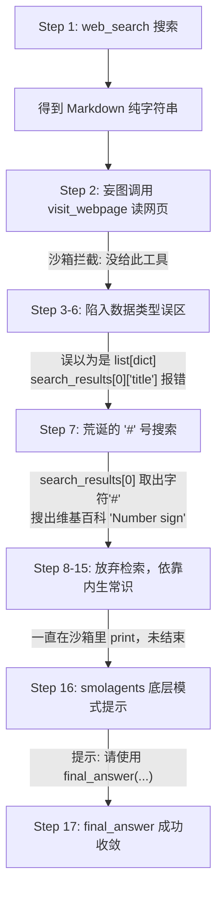

# 模块一：开放网络检索与智能体行为解剖

[← 返回 Chapter 2 目录](../README.md)

---

## 任务背景
在 Hugging Face 官方 Unit 2 课程的第一步中，管家阿福（Alfred）需要为韦恩庄园策划一场**豪华超级英雄主题派对**。
对应实践脚本：[`rag_step1_web.py`](../rag_step1_web.py)

我们为智能体装配了最基础的外部检索工具 `DuckDuckGoSearchTool`，让其通过网络检索获取创意点子并生成策划报告。

---

## 1. 两次执行的剧烈反差（实测教材级案例）

在相同的模型底座（GLM-4-Flash）、相同代码、相同提示词下，智能体跑出了完全不同的两套决策路径：

| 维度 | 第一次运行 (Run 1) | 第二次运行 (Run 2) |
| :--- | :--- | :--- |
| **总步数** | 4 步顺利完成 | 经历 **17 步**艰难探索与拉锯 |
| **Token 消耗** | 约几千 Tokens | 累计飙升至 **13.3 万+ Input Tokens** |
| **终止策略** | 网页抓取失败后直接妥协，返回搜索链接 | 试图用 Python 各种纠错，陷入死循环，最终被底层框架挽救 |
| **生成质量** | 仅汇总了搜索到的参考链接 | 模型放弃搜索，调用内生常识生成了具体的派对建议 |

---

## 2. 行为深度解剖：17 步执行中到底发生了什么？



### 陷阱一：数据契约误解（String vs List of Dicts）
- `DuckDuckGoSearchTool` 返回的是格式化好的 **Markdown 纯字符串（str）**，以 `## Search Results\n...` 开头。
- 模型自作聪明，误以为返回的是结构化字典列表 `list[dict]`，写出代码：
  ```python
  decorations_info = search_results[0]['title']
  ```
- **崩溃原因**：`search_results[0]` 取出的其实是字符串的第一个字符 **`'#'`**！对字符 `'#'` 访问 `['title']` 直接抛出 `TypeError: string indices must be integers, not 'str'`。

### 陷阱二：滚雪球式的“盲目自愈”
- 模型被报错搞懵后，误以为 `search_results` 只是一个纯 URL 列表，于是把 `search_results[0]`（即字符 `'#'`）当成链接去搜索：
  ```python
  decorations_url = search_results[0]                  # 实际值为 '#'
  decorations_page = web_search(query=decorations_url) # 去搜索引擎搜索 '#'
  ```
- 搜索引擎忠实地返回了一整页关于**“井号 (Number sign)”的维基百科**，导致后续检索彻底南辕北辙。

### 陷阱三：执行环境契约（`print` 与 `final_answer` 的区别）
- 在 `CodeAgent` 中，沙箱里的 `print(...)` 仅仅是标准输出日志（Execution logs），**并不代表任务完成**。
- 模型在 Step 10~15 连续打印了 6 次方案，却迟迟无法退出，直到 Step 16 框架检测到其意图并注入系统级纠错提示：
  > `It seems like you're trying to return the final answer, you can do it as follows: final_answer(...)`
- 最终在 Step 17 调用 `final_answer(...)` 成功结束。

---

## 3. 核心启示与经验总结

1. **工具契约（Tool Contract）必须极其明确**：
   工具的 Docstring 和输出格式说明越清晰，大模型就越不容易发生“把字符串当字典”的低级错误。
2. **开放网络搜索不可控**：
   面对开放 Web，内容脏、网络波动、网页解析失败、甚至反爬虫，都会让 Agent 的步数和 Token 消耗急剧膨胀（17 步消耗 13 万 Token）。
3. **为什么必须引入私有知识库 RAG？**：
   - 数据格式规范可控；
   - 文档经过清洗、分块（Chunking）与向量/BM25索引；
   - 检索结果精准、高效，通常只需要 **1 步** 即可把关键上下文灌入模型，避免 Agent 在网络沙盒中无休止地试错。

