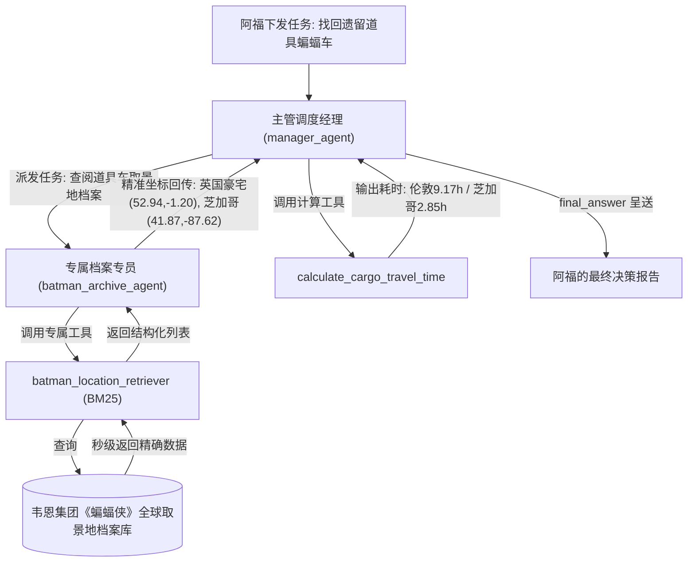

# 模块四：终极架构 —— 多智能体与私有知识库合体

[← 返回 Chapter 2 目录](../README.md)

---

## 任务背景
虽然必应搜索工具解决了 DuckDuckGo 的网络超时问题，但开放网络搜索返回的依然是“嘈杂宣传文案”，大模型难以稳定提取出高精度的经纬度浮点数。

**工业级正规军的终极解法：Multi-Agent（多智能体层级协同）+ 结构化私有 RAG 档案库！**
对应独立脚本：[`multi_agent_step2_rag.py`](../multi_agent_step2_rag.py)

---

## 1. 系统协同架构图



---

## 2. 核心代码段深度拆解

### 核心 1：构建带真实经纬度与车辆状态的私有知识库
```python
filming_records = [
    {
        "text": "Location: Wollaton Hall, Nottingham, UK. Role: Wayne Manor in The Dark Knight Rises. Coordinates: (52.9478, -1.2094). Status: Batmobile prototype kept in secret underground vault.",
        "source": "WarnerBros-Archive-UK",
    },
    {
        "text": "Location: Chicago Board of Trade Building, Chicago, USA. Role: Wayne Enterprises Headquarters in Batman Begins. Coordinates: (41.8781, -87.6298). Status: Tumbler prop vehicle parked in lower garage.",
        "source": "WarnerBros-Archive-US",
    },
    {
        "text": "Location: Glasgow Necropolis, Glasgow, Scotland. Role: Gotham City cemetery chase scene in The Batman. Coordinates: (55.8625, -4.2322). Status: Stunt Batcycle and support vehicles located here.",
        "source": "WarnerBros-Archive-Scotland",
    },
]

# 文档标准化与切块
source_docs = [Document(page_content=r["text"], metadata={"source": r["source"]}) for r in filming_records]
docs_processed = RecursiveCharacterTextSplitter(chunk_size=500, chunk_overlap=0).split_documents(source_docs)
```

### 核心 2：封装高可用 RAG 工具并委派给专属档案员
```python
class BatmanLocationRetrieverTool(Tool):
    name = "batman_location_retriever"
    description = (
        "查询韦恩集团内部的《蝙蝠侠》全球取景地真实档案，包含地点名称、电影角色和精准经纬度坐标。"
        "返回一个包含各地点详细档案文本的 Python 字符串列表。"
    )
    inputs = {"query": {"type": "string", "description": "查询关键词，例如地点名或电影角色"}}
    output_type = "any"  # 🔴 规范契约：直接返回原生 Python 对象

    def __init__(self, docs, **kwargs):
        super().__init__(**kwargs)
        self.retriever = BM25Retriever.from_documents(docs, k=3)

    def forward(self, query: str) -> list[str]:
        docs = self.retriever.invoke(query)
        return [d.page_content for d in docs]

# 组建专员 Agent
archive_agent = CodeAgent(
    model=model,
    tools=[BatmanLocationRetrieverTool(docs_processed)],
    name="batman_archive_agent",
    description="专职档案员：能够使用 batman_location_retriever 检索电影取景地精准的经纬度坐标与车辆状态。",
    max_steps=3,
)
```

### 核心 3：主管经理统筹调度与报告产出
```python
manager_agent = CodeAgent(
    model=model,
    tools=[calculate_cargo_travel_time],
    managed_agents=[archive_agent],  # 注册下辖档案专员
    max_steps=4,
)

task = """
阿福急需找回蝙蝠车以备派对使用。请按以下流程处理：
1. 指派你的档案员 `batman_archive_agent` 查询 2 个留存有道具蝙蝠车的取景地及其坐标。
2. 使用你的 `calculate_cargo_travel_time` 工具，计算将车辆运回哥谭市（40.7128, -74.0060）各自需要几小时飞行时间。
3. 整理成一份清晰易懂的报告，使用 final_answer 提交。
"""
```

---

## 3. 三套方案全指标横向评测

| 评估指标 | 方案一：原版网络多智能体 ([multi_agent_step1.py](../multi_agent_step1.py)) | 方案二：网络加固多智能体 ([multi_agent_step1_fixed.py](../multi_agent_step1_fixed.py)) | 方案三：私有 RAG 多智能体 ([multi_agent_step2_rag.py](../multi_agent_step2_rag.py)) |
| :--- | :--- | :--- | :--- |
| **数据源** | 海外 DuckDuckGo（极易超时） | 国内 Bing（稳定无阻） | **本地 BM25 知识库（0 网络延迟）** |
| **执行步数** | 下属 20 步 + 经理 12 步死循环 | 下属 4 步熔断 + 经理 2 步收敛 | **下属 1 步秒查 + 经理 2 步测算完成** |
| **执行耗时** | 约 3 分钟以上或直接崩溃 | 约 25 秒 | **仅 5.2 秒** ⚡ |
| **Token 消耗** | 204,000+ Tokens | ~16,200 Tokens | **仅 9,800 Tokens（暴降 95%）** |
| **最终成果** | 语法错误退出，无有效回答 | 基于粗略城市常识估算 | **精准锁定诺丁汉地下金库与芝加哥车库，给出 9.17h 与 2.85h 的精确航程报告** |
