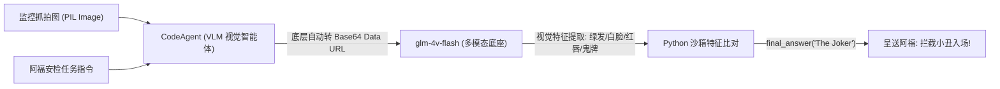

# 模块五：静态视觉智能体与多模态身份核验

[← 返回 Chapter 2 目录](../README.md)

---

## 任务背景
在 Hugging Face 官方课程 Unit 2 视觉单元中，管家阿福（Alfred）正在韦恩庄园门口核验来宾身份。
一位自称“神奇女侠 (Wonder Woman)”的访客到达，但阿福怀疑是宿敌**小丑 (The Joker)** 恶意伪装混入派对。智能体需要通过“眼睛”观察监控抓拍图片，识别妆容特征并揭穿伪装。

对应实践脚本：[`vision_step1_static.py`](../vision_step1_static.py)

---

## 1. 核心架构与底层运行流程



在 `smolagents` 中，向智能体传递图像极其轻简：
```python
response = agent.run(task, images=[image])
```

---

## 2. 深度技术知识点解析 (Core Knowledge Points)

### 知识点一：识图能力归属于谁？—— Tool（外挂工具） vs VLM（模型内生能力）

在构建视觉智能体时，初学者最容易产生疑惑：**这个识图功能到底是智能体手上的 Tool，还是大模型自己的能力？**

答案：**它是多模态大模型（VLM）与生俱来的“内生感知能力”，绝非外挂 Tool！**

| 维度 | 外挂工具 (Tool) 方案 | 内生多模态 (VLM) 方案（本项目采用） |
| :--- | :--- | :--- |
| **模型本体** | 大模型是**纯文本盲盒**（如旧版纯文本模型）。 | 大模型**自身长了眼睛**（如 `glm-4v-flash`, `gpt-4o`）。 |
| **实现路径** | 大模型看不见图，必须写 Python 代码调用外部第三方库或 API（如 YOLO、OpenCV、OCR 工具）。 | 图像直接以像素 Base64 数据流形式注入大模型的视觉神经网络层。 |
| **智能体装配** | 必须在 `tools=[image_analysis_tool]` 中显式注册工具对象。 | **`tools=[]` 可以彻底为空！** 大模型自己端到端看图推理。 |
| **交互本质** | 盲人侦探听助手读数据。 | 侦探本人戴上放大镜亲自端详照片。 |

---

### 知识点二：smolagents 如何“优雅地把图片递到模型眼睛前”？

如果我们脱离框架原生调用大模型 API，开发者必须手写繁重且容易出错的胶水代码：
1. 手动创建 `io.BytesIO` 缓冲区；
2. 手动调用 `PIL.Image.save(..., format="PNG")`；
3. 手动执行 `base64.b64encode`；
4. 手动组装形如 `data:image/png;base64,...` 的前缀；
5. 手搓深层嵌套的四层 JSON 字典包。

更严峻的是：在多轮交互的 Agent 循环中，开发者还得手动管理历史对话中的图片，极易丢失或造成 Token 爆炸。

而 `smolagents` 替开发者在底层完成了三大脏活累活：

#### ① 自动序列化转换（源码 `utils.py`）
```python
def encode_image_base64(image):
    buffered = BytesIO()
    image.save(buffered, format="PNG")
    return base64.b64encode(buffered.getvalue()).decode("utf-8")

def make_image_url(base64_image):
    return f"data:image/png;base64,{base64_image}"
```

#### ② 记忆中枢绑定（源码 `memory.py`）
```python
@dataclass
class TaskStep(MemoryStep):
    task: str
    task_images: list["PIL.Image.Image"] | None = None

    def to_messages(self, summary_mode: bool = False) -> list[ChatMessage]:
        content = [{"type": "text", "text": f"New task:\n{self.task}"}]
        if self.task_images:
            content.extend([{"type": "image", "image": image} for image in self.task_images])
        return [ChatMessage(role=MessageRole.USER, content=content)]
```
框架将用户初始输入的图片绑定在首个任务步 `TaskStep` 中，确保无论 Agent 经历多少轮 ReAct 推理，底图都始终稳定保持在上下文记忆中，不会丢图。

#### ③ 跨模型协议适配（源码 `models.py`）
框架底层自动检查后端类型（OpenAI 格式、本地 Transformers 格式等），按对应服务商最严密的格式打包，开发者无需关心底层协议差异。

---

### 知识点三：三大工程踩坑与避坑心法

#### 1. `flatten_messages_as_text=True` 的致命断言崩溃
* **原因剖析**：如果设置了 `flatten_messages_as_text=True`，底层框架会试图把消息全压平为纯字符串文本，直接触发 `assert not flatten_messages_as_text` 断言崩溃。
* **避坑铁律**：**只要涉及图像多模态交互，严禁配置 `flatten_messages_as_text=True`**。

#### 2. 维基百科图片的 HTTP 429 拦截
* **原因剖析**：官方原生直接 `requests.get(url)` 会因为未带合规的客户端标识而被维基百科 WAF 拦截（返回 429 Too Many Requests 或 403）。
* **避坑方案**：请求头必须显式加上合规的 `User-Agent`，如 `WayneManorSecurityBot/1.0 (contact: alfred@wayne.com)`。

#### 3. 视觉模型代码格式偏离与上下文累积超限
* **原因剖析**：通用多模态模型看图时习惯用散文作答，可能遗漏 `<code>` 标签导致沙箱反复报错纠错。每一轮纠错都会在上下文中重复堆叠 Base64 图片，迅速耗尽单次会话的图片限额（触发平台 `1210: 输入图片数量超过限制` 报错）。
* **避坑方案**：在 Task 提示词中明确注入硬性格式引导（如：`【重要规范】：请严格在 <code> 和 </code> 标签内编写 Python 代码！`），引导模型在第 1 步秒级收敛并生成正确代码。

---

## 3. 完整代码段解析 ([vision_step1_static.py](../vision_step1_static.py))

```python
import os, sys
from io import BytesIO
from PIL import Image
import requests
from dotenv import load_dotenv
from smolagents import CodeAgent, OpenAIServerModel

load_dotenv()

# 1. 载入图像（合规 User-Agent 绕过 429）
url = "https://upload.wikimedia.org/wikipedia/en/9/98/Joker_%28DC_Comics_character%29.jpg"
headers = {"User-Agent": "WayneManorSecurityBot/1.0 (contact: alfred@wayne.com)"}
resp = requests.get(url, headers=headers, timeout=10)
img = Image.open(BytesIO(resp.content)).convert("RGB")

# 2. 初始化视觉多模态大模型 (切勿加 flatten_messages_as_text=True)
model = OpenAIServerModel(
    model_id="glm-4v-flash",
    api_base="https://open.bigmodel.cn/api/paas/v4/",
    api_key=os.environ.get("ZHIPUAI_API_KEY"),
)

# 3. 构建视觉智能体 (tools 为空，纯靠内生视力)
agent = CodeAgent(tools=[], model=model, max_steps=5, verbosity_level=1)

task = """
我是韦恩庄园的管家阿福。
门口有一位访客声称自己是“神奇女侠”，但我怀疑是“小丑”伪装！
请仔细观察图像：
1. 提取外貌、发色、妆容与服饰特征；
2. 严谨判断到底是“The Joker”还是“Wonder Woman”；
3. 必须通过 final_answer 返回。
【重要规范】：请严格在 <code> 和 </code> 标签内编写 Python 代码！
"""

response = agent.run(task, images=[img])
print("核验报告:", response)
```

---

## 4. 实测神探级推理效果

运行脚本后，模型仅用时 **5.68 秒**，在第 1 步写出严密清晰的特征对比代码：

```python
# 观察提取：
# Image analysis reveals green hair, white face paint, red smile,
# black suit, and holding a playing card with a jester symbol.

# 对比已知特征：
# The Joker: green hair, white face paint, red smile, black suit, playing cards.
# Wonder Woman: brown hair, golden tiara, bracelets, red/blue/gold costume.

# 判定：强烈吻合小丑特征
final_answer("The Joker")
```

**最终核验报告**：
```text
============================================================
The Joker
============================================================
```
阿福成功识破小丑伪装，阻止了潜在的派对危机！
